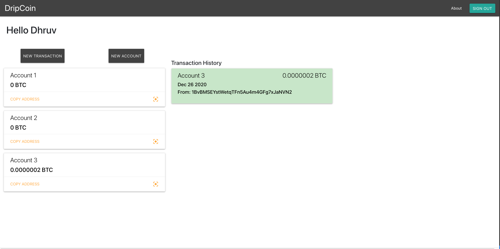

# Dripcoin - `A bitcoin wallet simulator`


Dripcoin is a fullstack MERN application that simulates a bitcoin wallet. I was always interested in learning how crypto-currencies, block chains, and transactions function today. In the progress of developing this application, I gained a great amount of insight into these elements. I dove deep into encryption methods and security measures that are often taken by crypto-currencies to holders. 

## Features
- Multi-user sign-in
- Generate multiple bitcoin wallets
- Send bitcoin from one address to another address
- Display a QR code for each bitcoin address for transactions (in progress)
- Secure JWT token pass
- Automated transaction receipt generation after every transfer 

## How to use
1. Sign up using your personal email
2. Start off by clicking the button at the left to create your first wallet
3.  Make a transaction by clicking on the 'new transaction' button. You'll need to use a real address

## Demo Photo



## Prerequisites
Before you clone/fork, ensure you have met the following requirements:
- You have installed the latest version for NodeJS
- You have your own MongoDB cluster
- Your own `.env` file. It should look like this:
```
BLOCKCHAIN_TOKEN=<Block Cypher API token>
MONGOURI=<Your mongo uri>
JWTTOKEN=<Your jwt encryption keyword>
SENDGRID_TOKEN=<Sendgrid api token>
```

## Technologies
- MongoDB
- ExpressJS
- ReactJS
- NodeJS
- Blockcypher API
- SendGrid/Nodemailer
- JWT Passport system


